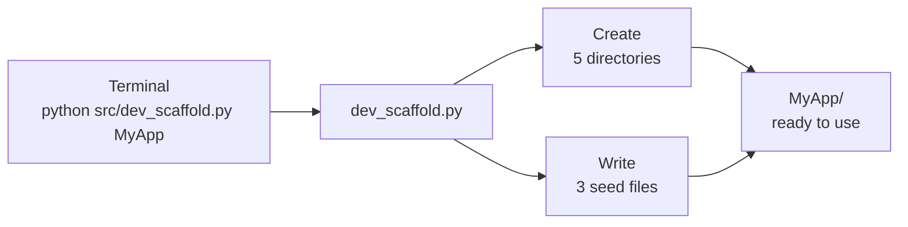
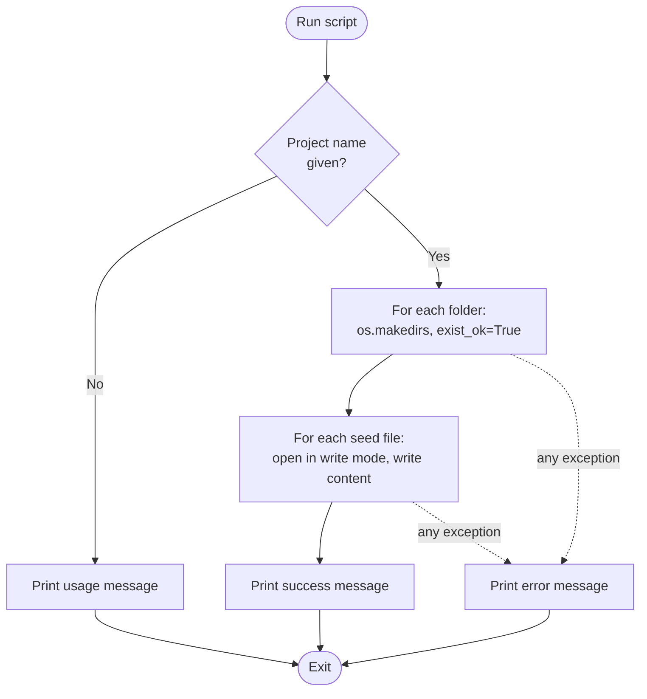
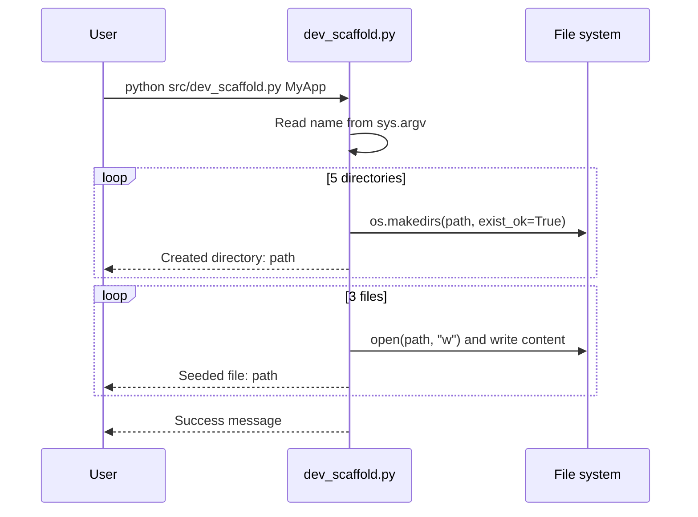
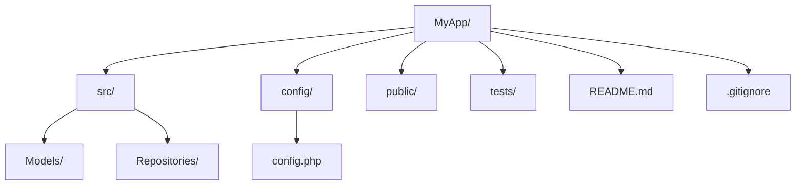
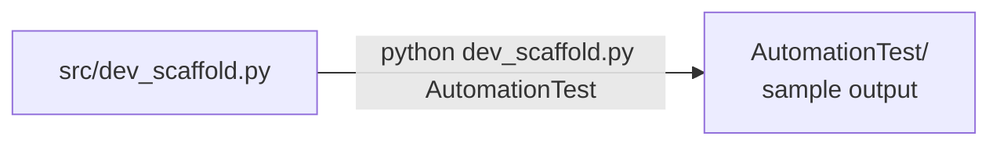
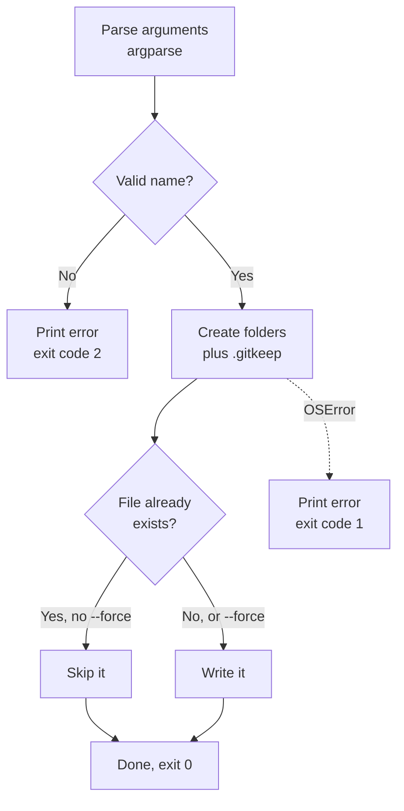
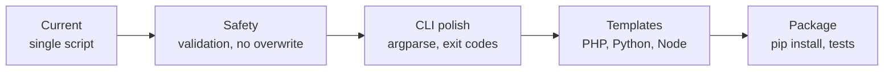

# DevScaffold

A tiny, zero-dependency Python CLI that creates a standard project skeleton in one command: a folder structure, a starter `README.md`, a `.gitignore`, and a `config.php` placeholder.


---

## Table of Contents

1. [Overview](#1-overview)
2. [How It Works](#2-how-it-works)
3. [Requirements](#3-requirements)
4. [Installation](#4-installation)
5. [Usage](#5-usage)
6. [What Gets Generated](#6-what-gets-generated)
7. [Repository Structure](#7-repository-structure)
8. [Code Walkthrough](#8-code-walkthrough)
9. [Customizing the Template](#9-customizing-the-template)
10. [Known Limitations](#10-known-limitations)
11. [Suggested Improvements](#11-suggested-improvements)
12. [Roadmap](#12-roadmap)
13. [License](#13-license)

---

## 1. Overview

Starting a project usually means repeating the same setup: make the folders, add a README, add a `.gitignore`. DevScaffold does that in a single command so every new project starts with the same layout.

| Feature | Detail |
|---|---|
| Instant scaffolding | Creates five directories in a layered `src/`, `config/`, `public/`, `tests/` layout |
| Auto-seeding | Writes a starter `README.md`, `.gitignore`, and `config/config.php` |
| Zero dependencies | Uses only Python's standard library (`os`, `sys`) |
| One file | The entire tool is `src/dev_scaffold.py` (about 40 lines) |

The template is PHP-flavored: `Models` and `Repositories` folders, a `config.php` file, and `vendor/` in the generated `.gitignore`.

---

## 2. How It Works

### 2.1 Big picture



### 2.2 Execution flow



### 2.3 Step-by-step sequence



---

## 3. Requirements

- **Python 3.6 or newer** (the script uses f-strings)
- Any OS that runs Python (Windows, macOS, Linux)
- No `pip install` needed

---

## 4. Installation

```bash
git clone <your-repo-url>
cd DevScaffold
```

That is all. There is nothing to build or install.

---

## 5. Usage

```bash
python src/dev_scaffold.py <ProjectName>
```

The project is created in your **current working directory**, not next to the script.

### Example

```bash
python src/dev_scaffold.py MyApp
```

Output:

```text
--- 🛠️ Initializing Project Architecture: MyApp ---
Created directory: MyApp/src/Models
Created directory: MyApp/src/Repositories
Created directory: MyApp/config
Created directory: MyApp/public
Created directory: MyApp/tests
Seeded file: MyApp/README.md
Seeded file: MyApp/.gitignore
Seeded file: MyApp/config/config.php

✅ Success: Professional structure for 'MyApp' is ready.
```

### Running without a name

```bash
python src/dev_scaffold.py
# Usage: python src/dev_scaffold.py <ProjectName>
```

### Running from anywhere

You can call the script by absolute path and create the project wherever you are:

```bash
cd ~/projects
python ~/tools/DevScaffold/src/dev_scaffold.py ClientSite
```

---

## 6. What Gets Generated

### 6.1 Directory layout



```text
MyApp/
├── README.md
├── .gitignore
├── config/
│   └── config.php
├── public/
├── src/
│   ├── Models/
│   └── Repositories/
└── tests/
```

### 6.2 Purpose of each folder

| Path | Intended use |
|---|---|
| `src/Models/` | Domain and data model classes |
| `src/Repositories/` | Data-access classes |
| `config/` | Application configuration |
| `public/` | Web-served files (entry point, assets) |
| `tests/` | Automated tests |

### 6.3 Seeded files

| File | Content |
|---|---|
| `README.md` | A heading with the project name and the line "Project initialized via DevScaffold automation." |
| `.gitignore` | `__pycache__/`, `.env`, `*.log`, `vendor/` |
| `config/config.php` | `<?php` followed by the comment `// Configuration settings` |

---

## 7. Repository Structure

```text
DevScaffold/
├── README.md
├── .gitignore                  # currently empty
├── src/
│   └── dev_scaffold.py         # the tool
└── AutomationTest/             # sample output from an earlier test run
    ├── README.md               # copy of the DevScaffold README
    ├── .gitignore              # matches the generated .gitignore
    └── config/
        └── config.php          # matches the generated config.php
```

`AutomationTest/` is a committed example of what the script generates. Its `.gitignore` and `config.php` are identical to the script's output. Its `README.md` is a copy of DevScaffold's own README, not the one the script would generate. The empty folders (`Models`, `Repositories`, `public`, `tests`) are missing from the repository because git does not track empty directories.



---

## 8. Code Walkthrough

### `src/dev_scaffold.py`

```python
import os
import sys

def create_project(name):
    structure = [
        f"{name}/src/Models",
        f"{name}/src/Repositories",
        f"{name}/config",
        f"{name}/public",
        f"{name}/tests"
    ]

    try:
        # 1. Create folders
        for folder in structure:
            os.makedirs(folder, exist_ok=True)

        # 2. Seed essential files
        files = {
            f"{name}/README.md": f"# {name}\n\nProject initialized via DevScaffold automation.",
            f"{name}/.gitignore": "__pycache__/\n.env\n*.log\nvendor/",
            f"{name}/config/config.php": "<?php\n// Configuration settings",
        }
        for path, content in files.items():
            with open(path, "w") as f:
                f.write(content)

    except Exception as e:
        print(f"❌ Critical Error during scaffolding: {e}")

if __name__ == "__main__":
    if len(sys.argv) < 2:
        print("Usage: python src/dev_scaffold.py <ProjectName>")
    else:
        create_project(sys.argv[1])
```

(Print statements are trimmed here for brevity.)

| Part | What it does |
|---|---|
| `structure` | List of folders to create, each prefixed with the project name |
| `os.makedirs(..., exist_ok=True)` | Creates the folder and any missing parents; does not fail if it already exists |
| `files` | Dictionary mapping each file path to its contents |
| `open(path, "w")` | Opens for writing, creating the file or **replacing** an existing one |
| `sys.argv[1]` | The first command-line argument, used as the project name |
| `try / except Exception` | Catches any error and prints a message |

---

## 9. Customizing the Template

To change what gets generated, edit the two data structures inside `create_project`.

**Add a folder**

```python
structure = [
    f"{name}/src/Models",
    f"{name}/src/Repositories",
    f"{name}/src/Services",      # new
    f"{name}/config",
    f"{name}/public",
    f"{name}/tests",
]
```

**Add a file**

```python
files = {
    f"{name}/README.md": f"# {name}\n\nProject initialized via DevScaffold automation.",
    f"{name}/.gitignore": "__pycache__/\n.env\n*.log\nvendor/",
    f"{name}/config/config.php": "<?php\n// Configuration settings",
    f"{name}/.editorconfig": "root = true\n\n[*]\ncharset = utf-8\n",   # new
}
```

Add any new file's parent folder to `structure` first, or the write will fail.

---

## 10. Known Limitations

I ran the script to verify each of these.

- **Existing files are overwritten silently.** Running the tool on a name that already exists replaces `README.md`, `.gitignore`, and `config/config.php`, including any edits you made. Folders are kept (`exist_ok=True`), but there is no warning and no prompt.
- **No name validation.** The name is used directly as a path. `python src/dev_scaffold.py ../escaped` creates the project *outside* your current directory, and absolute paths work too. Names with spaces or special characters are passed straight through.
- **Extra arguments are ignored.** `python src/dev_scaffold.py A B` creates only `A`.
- **Exit code is always 0.** A missing name and a failed run both exit with status 0, so shell scripts and CI cannot detect failure.
- **Empty folders are invisible to git.** `Models`, `Repositories`, `public`, and `tests` contain no files, so `git add` skips them. A freshly generated project shows only three tracked files.
- **"PSR-4" is a stretch.** PSR-4 is an autoloading standard that needs namespaces and a `composer.json` autoload mapping. The generated structure has neither, so it is PSR-4-*style* folder naming, not compliance.
- **Mixed-language template.** The `.gitignore` combines Python entries (`__pycache__/`) with PHP ones (`vendor/`), and `config.php` is PHP, while the tool itself is Python.
- **Emoji output on old consoles.** The status messages contain emoji. Terminals with a legacy encoding, such as some Windows code pages, can raise `UnicodeEncodeError`. On failure, the error is caught and the message may not appear.
- **Generated files lack a trailing newline.**
- **README defects.** The previous README's Usage block was never closed and had a leftover "Step 4: Final Git Push" note pasted into it, and the usage line omitted the `<ProjectName>` argument. This document replaces it. The `AutomationTest/README.md` copy still has the old text.
- **No tests, no LICENSE file.** The root `.gitignore` is empty.

---

## 11. Suggested Improvements

A hardened version that fixes the overwrite, validation, exit-code, and empty-folder issues. I ran it to confirm the behavior described below.

```python
import argparse
import re
import sys
from pathlib import Path

NAME_RE = re.compile(r"^[A-Za-z][A-Za-z0-9_-]*$")

DIRS = ["src/Models", "src/Repositories", "config", "public", "tests"]


def create_project(name: str, force: bool = False) -> None:
    root = Path(name)
    files = {
        "README.md": f"# {name}\n\nProject initialized via DevScaffold automation.\n",
        ".gitignore": "__pycache__/\n.env\n*.log\nvendor/\n",
        "config/config.php": "<?php\n// Configuration settings\n",
    }

    for d in DIRS:
        folder = root / d
        folder.mkdir(parents=True, exist_ok=True)
        (folder / ".gitkeep").touch()  # lets git track otherwise-empty folders
        print(f"Created directory: {folder}")

    for rel, content in files.items():
        path = root / rel
        if path.exists() and not force:
            print(f"Skipped (already exists): {path}")
            continue
        path.write_text(content, encoding="utf-8")
        print(f"Seeded file: {path}")


def main() -> int:
    parser = argparse.ArgumentParser(description="Scaffold a new project.")
    parser.add_argument("name", help="project name (letters, digits, - and _)")
    parser.add_argument("--force", action="store_true",
                        help="overwrite existing seeded files")
    args = parser.parse_args()

    if not NAME_RE.match(args.name):
        print("Error: name must start with a letter and contain only "
              "letters, digits, '-' or '_'.", file=sys.stderr)
        return 2
    try:
        create_project(args.name, args.force)
    except OSError as e:
        print(f"Error: {e}", file=sys.stderr)
        return 1
    print(f"Done: '{args.name}' is ready.")
    return 0


if __name__ == "__main__":
    sys.exit(main())
```



What changes:

| Problem | Fix |
|---|---|
| Silent overwrite | Existing files are skipped unless `--force` is passed |
| Path traversal and odd names | Name must match `^[A-Za-z][A-Za-z0-9_-]*$` |
| Extra or missing arguments | `argparse` handles them and prints usage |
| Exit code always 0 | 0 on success, 1 on file errors, 2 on bad input |
| Empty folders untracked | A `.gitkeep` file is added to each folder |
| Encoding | Explicit `utf-8` and no emoji in the output |
| Missing trailing newline | Seed files end with `\n` |

---

## 12. Roadmap



- [ ] Validate the project name
- [ ] Refuse to overwrite existing files unless `--force`
- [ ] Use `argparse` and meaningful exit codes
- [ ] Add `.gitkeep` files so empty folders are tracked
- [ ] Generate a `composer.json` with a PSR-4 autoload mapping if PHP is the target
- [ ] Offer multiple templates through a `--template` option
- [ ] Add unit tests using `tempfile.TemporaryDirectory`
- [ ] Add a `pyproject.toml` so it can be installed as a command
- [ ] Add a LICENSE

---

## 13. License

No license file is included yet. Add one (for example MIT) before publishing.
