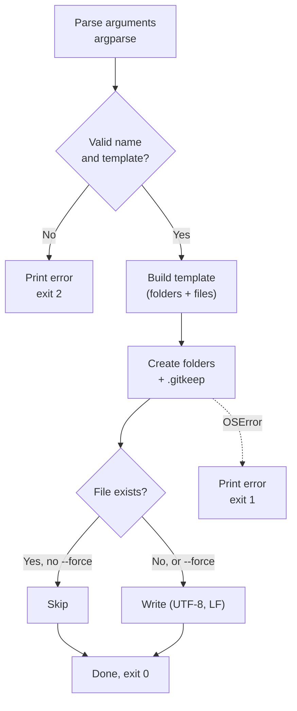

# DevScaffold

A zero-dependency Python CLI that creates a consistent project skeleton in one command. It has PHP and Python templates, refuses unsafe names, never overwrites your work unless told to, and returns proper exit codes so it can run inside scripts and CI.


---

## Table of Contents

1. [Overview](#1-overview)
2. [Installation](#2-installation)
3. [Usage](#3-usage)
4. [Templates](#4-templates)
5. [How It Works](#5-how-it-works)
6. [Safety Guarantees](#6-safety-guarantees)
7. [Repository Structure](#7-repository-structure)
8. [Adding a Template](#8-adding-a-template)
9. [Testing](#9-testing)
10. [Roadmap](#10-roadmap)
11. [License](#11-license)

---

## 1. Overview

Starting a project means repeating the same setup every time: folders, README, `.gitignore`, config, a package manifest. DevScaffold does it in one command, so every project starts from the same known-good layout.

| Feature | Detail |
|---|---|
| Templates | `php` (layered `src/Models`, `src/Repositories`, `src/Services` with a PSR-4 `composer.json`) and `python` (`src/` layout with `pyproject.toml` and a smoke test) |
| Safe re-runs | Existing files are skipped; `--force` is required to overwrite |
| Input validation | Names must match `^[A-Za-z][A-Za-z0-9_-]*$`, which blocks `../` and absolute paths |
| Script-friendly | Exit codes: `0` success, `1` filesystem error, `2` bad input |
| Git-friendly | Every folder gets a `.gitkeep`, so the structure survives the first commit |
| Zero dependencies | Standard library only (`argparse`, `pathlib`, `json`, `re`) |

---

## 2. Installation

```bash
git clone https://github.com/JoshuaOmosa/DevScaffold.git
cd DevScaffold
pip install .          # installs the `dev-scaffold` command
```

Or run it without installing: `python src/dev_scaffold.py ...`

---

## 3. Usage

```text
dev-scaffold NAME [-t {php,python}] [--force] [--version]
```

```bash
dev-scaffold InventoryApi                 # PHP template (default)
dev-scaffold invoice-tool -t python       # Python template
dev-scaffold InventoryApi --force         # re-seed files, overwriting edits
```

Example output:

```text
Created directory: InventoryApi/src/Models
Created directory: InventoryApi/src/Repositories
...
Seeded file: InventoryApi/composer.json
Seeded file: InventoryApi/public/index.php
Done: 'InventoryApi' is ready (php template).
```

Running it again on the same name prints `Skipped (already exists): ...` for each seeded file and leaves your edits alone.

---

## 4. Templates

### `php` (default)

```text
InventoryApi/
├── .env.example          # DB_* placeholders; real .env is git-ignored
├── .gitignore
├── README.md
├── composer.json         # PSR-4: "InventoryApi\\" -> src/
├── config/config.php     # returns a settings array, strict_types on
├── public/index.php      # entry point, loads Composer's autoloader
├── src/
│   ├── Models/
│   ├── Repositories/
│   └── Services/
└── tests/
```

The PSR-4 namespace comes from the project name: `inventory-api` becomes `InventoryApi\`. Run `composer dump-autoload` and classes under `src/` load automatically.

### `python`

```text
invoice-tool/
├── .gitignore
├── README.md
├── pyproject.toml
├── src/invoice_tool/__init__.py
└── tests/test_smoke.py
```

The package name is the project name lower-cased with `-` replaced by `_`.

---

## 5. How It Works



Each template is a plain function returning `(folders, {path: content})`. `create_project()` does all the filesystem work, so templates contain no I/O and are easy to test.

---

## 6. Safety Guarantees

| Risk | How it's handled |
|---|---|
| Overwriting work | Seeded files are skipped if present unless `--force` is passed |
| Path traversal (`../x`, `/abs`, `a/b`) | Rejected by the name pattern before anything is written |
| Silent failure in scripts | Non-zero exit codes on bad input and filesystem errors |
| Empty folders lost in git | `.gitkeep` in every folder |
| Encoding problems on Windows consoles | UTF-8 file writes, plain-ASCII console output |

---

## 7. Repository Structure

```text
DevScaffold/
├── .github/workflows/tests.yml   # CI: Linux + Windows, Python 3.9 and 3.12
├── src/dev_scaffold.py           # The whole tool
├── tests/test_dev_scaffold.py    # Unit + CLI tests (stdlib unittest)
├── pyproject.toml                # Installs the `dev-scaffold` command
├── LICENSE
└── README.md
```

---

## 8. Adding a Template

Write a function that returns folders and files, then register it:

```python
def node_template(name):
    dirs = ["src", "test"]
    files = {
        "package.json": json.dumps({"name": name, "version": "0.1.0"}, indent=2) + "\n",
        ".gitignore": "node_modules/\n.env\n",
    }
    return dirs, files

TEMPLATES["node"] = node_template
```

It is immediately available as `dev-scaffold MyApp -t node`.

---

## 9. Testing

```bash
python -m unittest discover -s tests -v
```

The 11 tests run in temporary directories and cover both templates, PSR-4 namespace generation, trailing newlines, skip-vs-force behaviour, rejection of unsafe names (with a check that nothing was written), and CLI exit codes. GitHub Actions runs them on Linux and Windows, then installs the package and runs the command.

---

## 10. Roadmap

- [x] Name validation and safe re-runs
- [x] `argparse` CLI with exit codes
- [x] PHP template with PSR-4 `composer.json`
- [x] Python template
- [x] Unit tests and CI
- [x] Installable command via `pyproject.toml`
- [ ] Node / TypeScript template
- [ ] `--git` flag to run `git init` and make the first commit
- [ ] User-defined templates loaded from a folder

---

## 11. License

MIT. See [LICENSE](LICENSE).
